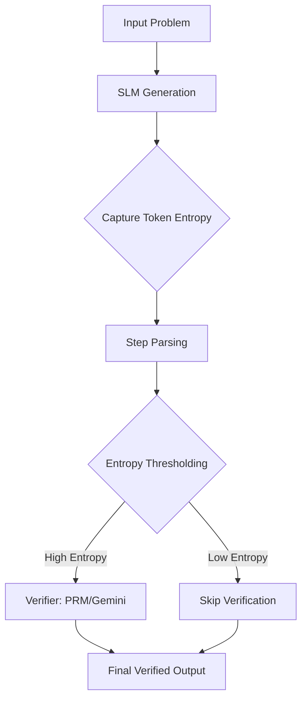

# Entropy-Based Selective Step Verification Using Process Reward Models on Small Language Models

**CS 517: Socially Responsible AI | University of Illinois at Chicago | Spring 2026**

## Overview

Process Reward Models (PRMs) provide a robust way to verify individual reasoning steps in language model outputs, but verifying every step is computationally expensive and slow. We propose an entropy-based selective verification framework that captures token-level uncertainty during generation. By routing only high-entropy (uncertain) steps to the verifier and skipping low-entropy (confident) steps, we achieve compute savings of 51-58% while maintaining high reliability.

## Project Architecture



## Key Results

| Model | Size | GSM8K Accuracy | Options Accuracy | GSM8K Entropy Gap | Compute Savings |
| :--- | :---: | :---: | :---: | :---: | :---: |
| Qwen2.5-Math-1.5B | 1.5B | 85.0% | 8.2% | +0.071 | 57.7% |
| Llama 3.2 3B | 3B | 70.0% | 7.3% | +0.063 | 51.5% |
| Gemma 3 4B | 4B | 72.0% | 3.6% | +0.047 | 56.5% |

## Key Findings

1. **Entropy as an Error Signal**: Wrong answers consistently exhibit higher entropy than correct answers across all tested models on the GSM8K dataset.
2. **Significant Efficiency Gains**: We achieved 51-58% compute savings through entropy-based selective verification, essentially halving the verification budget.
3. **Cross-Domain Consistency**: The compute savings remain consistent across drastically different domains (mathematical reasoning and financial options trading).
4. **Difficulty Correlation**: The entropy gap between correct and wrong answers widens as problem difficulty increases, with Qwen showing a 5x gap increase from easy to hard problems.
5. **Domain Sensitivity**: Small Language Models (SLMs) exhibit extreme overconfidence and failure when operating outside their training domain, dropping to 3-8% accuracy on the options trading dataset.
6. **Verifier Calibration**: The Math-Shepherd PRM (0.5B) often fails to flag errors in SLM reasoning, while the Gemini judge is highly aggressive, with a 70% flag rate on reasoning steps.

## Datasets

- **GSM8K**: 200 high-quality test problems, enriched with metadata for difficulty_level, reasoning_type, real_world_topic, and operation_types.
- **Options Trading**: A novel dataset of 110 problems using real Yahoo Finance market data, generated via a multi-agent verification pipeline (n8n).

## Models

| Model | Family | Size | Role |
| :--- | :--- | :---: | :--- |
| Qwen2.5-Math-1.5B-Instruct | Alibaba | 1.5B | Domain-specific Math specialist |
| Llama 3.2 3B Instruct | Meta | 3B | General-purpose reasoning |
| Gemma 3 4B Instruct | Google | 4B | General-purpose reasoning |

## Verifiers

- **Math-Shepherd PRM**: A Qwen2-0.5B model fine-tuned on the Math-Shepherd dataset for mathematical step-by-step verification.
- **Gemini LLM-as-Judge**: Gemini 2.5 Flash-Lite accessed via Vertex AI, used as a flexible verifier for both math and financial domains.

## Project Structure

```text
prm-project/
├── analysis/
│   ├── figures/             # 11 publication-quality PNG charts
│   └── tables/              # CSV summary tables for model performance
├── data/
│   ├── gsm8k/               # Enriched GSM8K test set with difficulty labels
│   └── options/             # Novel options trading dataset
├── results/                 # Raw JSON files containing entropy and verification logs
├── scripts/
│   ├── entropy_pipeline.py  # Core script for generation and entropy capture
│   ├── real_verify.py       # Implementation of PRM and Gemini judge logic
│   └── verify_strategies.py # Simulation of different verification budgets
├── requirements.txt         # Project dependencies
└── README.md                # Final documentation
```

## Setup and Usage

### Installation
```bash
python3 -m venv venv
source venv/bin/activate
pip install -r requirements.txt
```

### Running the Pipeline
1. **Entropy Generation**:
   `python3 scripts/entropy_pipeline.py qwen-math-1.5b --dataset options`
2. **Step Verification**:
   `python3 scripts/real_verify.py qwen-math-1.5b --dataset options`
3. **Generate Analysis**:
   `python3 analysis/generate_figures.py`

## Figures Gallery

- **Fig 1**: Model Accuracy Comparison (GSM8K)
- **Fig 2**: Entropy of Correct vs. Wrong Answers
- **Fig 3**: Step-Level Entropy Distribution
- **Fig 4**: Theoretical Compute Savings baseline
- **Fig 5**: Entropy Trends Across Step Positions
- **Fig 6**: Complexity vs. Model Uncertainty Scatter
- **Fig 7**: Confidently Wrong (Missed Detection) Analysis
- **Fig 8**: Cross-Domain Accuracy (GSM8K vs. Options)
- **Fig 9**: Options Trading: Correct vs. Wrong Entropy
- **Fig 10**: Entropy Gap Growth by Problem Difficulty
- **Fig 11**: Real-World Compute Savings Comparison

## References

- Lightman et al. (2023). "Let's Verify Step by Step."
- Wang et al. (2024). "Math-Shepherd: Verify and Reinforce LLMs Step-by-step."
- Wang et al. (2025). "Beyond the 80/20 Rule: High-Entropy Minority Tokens."
- Cao et al. (2026). "EDU-PRM: Educational Process Reward Modeling."
- Cobbe et al. (2021). "Training Verifiers to Solve Math Word Problems (GSM8K)."
- Yu et al. (2025). "GPO: Learning from Critical Steps to Improve LLM Reasoning."

## Authors
- Vaishnavi Jadhav
- Madhumitha Seshaiah

## Course
CS 517: Socially Responsible AI, Prof. Lu Cheng, University of Illinois at Chicago, Spring 2026